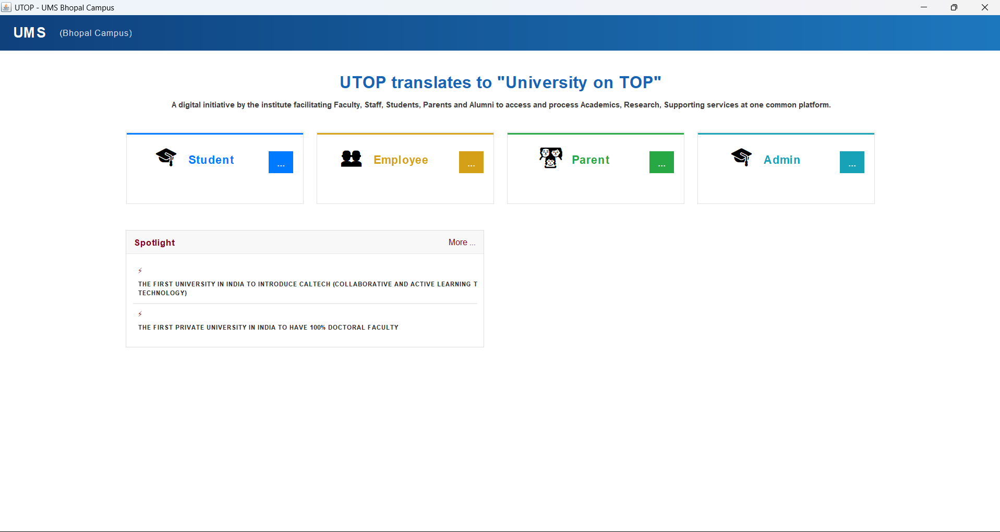

# 🎓 University Management System (UMS)

A modern desktop-based **Two-Tier Architecture** University Management System developed in Java (Swing & AWT) with MySQL relational database persistence. The system automates campus operations and record-keeping with specialized, role-tailored portals for Administrators, Students, Employees, and Parents.

---

## 🏗️ Architectural Overview (2-Tier Architecture)

The system follows a direct **Client-Server (Two-Tier)** architectural pattern:

```
+-------------------------------------------------------------+
|                        TIER 1                               |
|               Client Layer (Presentation & UI)              |
|   • Java Swing GUI (Main, Admin, Student, Employee, Parent) |
|   • Custom Color Palette, Layouts & Table Models            |
|   • Client-side validation & local interaction rules        |
+-------------------------------------------------------------+
                              │
                              │  JDBC Driver (TCP/IP Port 3306)
                              │  Direct PreparedStatements / SQL
                              ▼
+-------------------------------------------------------------+
|                        TIER 2                               |
|               Data Layer (Database Management)              |
|   • Relational Database (MySQL)                             |
|   • Tables for Users, Courses, Fees, Marks & Notifications  |
|   • ACID-compliant persistent storage                       |
+-------------------------------------------------------------+
```

* **Tier 1 (Client Application):** Handles the presentation interface and event-driven logic (`JFrame`, `JTable`, `DefaultTableModel`, `JComboBox`) across each dedicated user portal.
* **Tier 2 (Database Layer):** MySQL server managing persistent institutional data, schema enforcement, and query handling via `DBConnection`.

---

## 🖼️ Application Dashboards

### 1. Main Dashboard & Entry
> Central gateway to navigate between administrative, student, faculty, and parent portals.



---

### 2. Administrator Portal
> Complete administrative oversight for fee tracking, notifications, course additions, and user records.

.png)
.png)
.png)
.png)
.png)
.png)
.png)
.png)

---

### 3. Student Portal
> Self-service portal for enrolled students to view course registrations, attendance, semester grades, and dues.

.png)
.png)
.png)
.png)


---

### 4. Employee / Faculty Portal
> Dedicated interface for faculty and staff to update marks, manage class attendance, and view departmental circulars.


---

## ✨ Key Features & Portals

- **Admin Portal (`AdminFrame`):** Central management of faculty records, parent communication, student enrollments, fee structures, and campus-wide notifications.
- **Student Portal (`StudentFrame`):** View registered subjects, internal marks, attendance summaries, and pending fee status.
- **Employee Portal (`EmployeeFrame`):** Faculty toolset for inputting student marks, viewing schedules, and logging course attendance.
- **Parent Portal (`ParentFrame`):** Direct progress tracking, fee receipts, and official institutional announcements.
- **Database Central (`DBConnection`):** Connection pool handling optimized SQL queries and transactional integrity across all frames.

---

## 🛠️ Technology Stack

| Layer | Technology |
| :--- | :--- |
| **Language** | Java (JDK 21 / 24) |
| **UI Framework** | Java Swing & AWT (`javax.swing.*`, `java.awt.*`) |
| **Database** | MySQL Server |
| **Database Driver** | MySQL Connector/J (`JDBC`) |
| **IDE** | IntelliJ IDEA |

---

## 📂 Project Structure

```text
University Management System/
├── Images/
│   ├── main.png                # Main Dashboard Preview
│   ├── admin.png               # Administrator Portal Preview
│   ├── student.png             # Student Portal Preview
│   └── employee.png            # Employee Portal Preview
├── Project_Files/
│   ├── MySQL Queries Used      # SQL scripts & database schema
│   ├── src/
│   │   └── main/
│   │       ├── java/
│   │       │   └── in/
│   │       │       └── mak/
│   │       │           ├── AdminFrame.java     # Administrator Portal GUI & logic
│   │       │           ├── DBConnection.java   # MySQL JDBC Connection handler
│   │       │           ├── EmployeeFrame.java  # Faculty / Staff Portal
│   │       │           ├── Main.java           # Application Entry Point
│   │       │           ├── ParentFrame.java    # Parent Portal interface
│   │       │           └── StudentFrame.java   # Student Portal interface
│   │       └── resources/                      # Icons, fonts & static UI assets
│   └── pom.xml                                 # Build & dependency configuration
└── README.md
```

---

## ⚙️ Setup & Installation

### 1. Database Configuration
1. Open your MySQL client and execute the scripts located in `Project_Files/MySQL Queries Used`:
   ```sql
   CREATE DATABASE IF NOT EXISTS university_management_system;
   USE university_management_system;
   ```
2. Verify database connection credentials inside `in/mak/DBConnection.java`:
   ```java
   private static final String URL = "jdbc:mysql://localhost:3306/university_management_system";
   private static final String USER = "your_mysql_username";
   private static final String PASSWORD = "your_mysql_password";
   ```

### 2. Running in IntelliJ IDEA
1. Open IntelliJ IDEA and select the `Project_Files` directory (or root project directory).
2. Ensure Project SDK is configured: **File → Project Structure → Project → SDK (Java 21/24)**.
3. Open `src/main/java/in/mak/Main.java`.
4. Right-click and select **Run 'Main'** (or press `Shift + F10`).

---

## 📜 License
Distributed under the MIT License.
